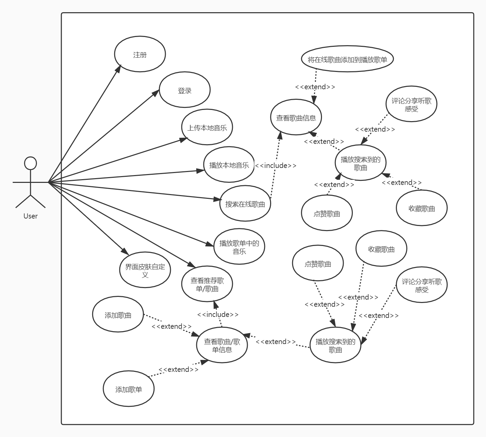
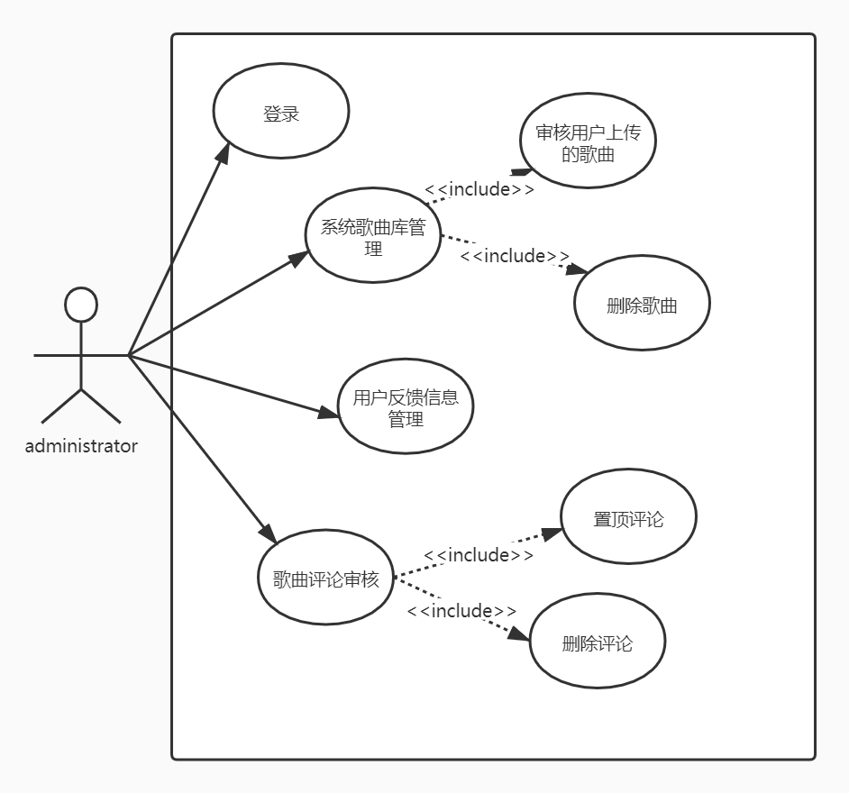
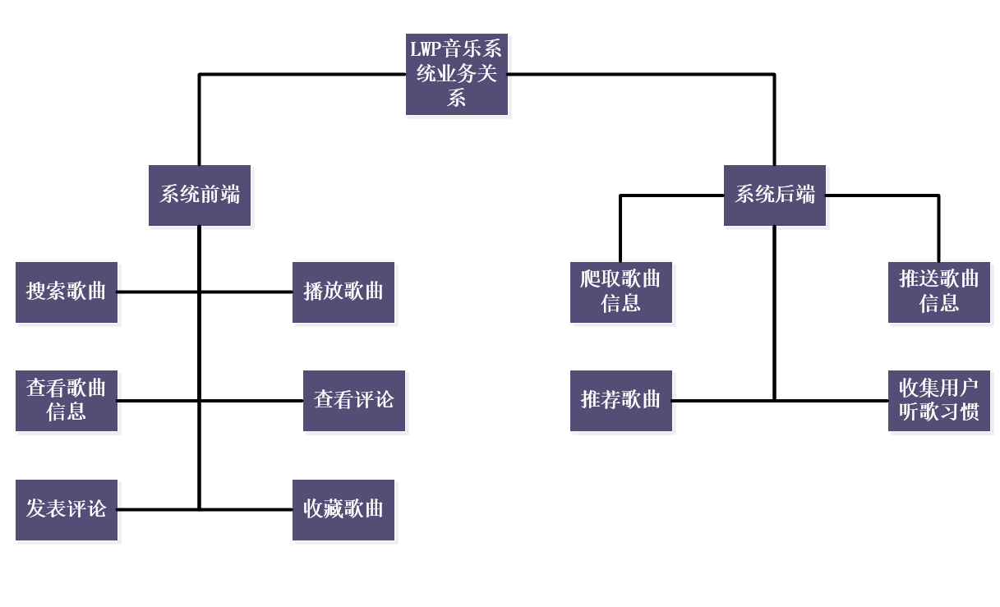
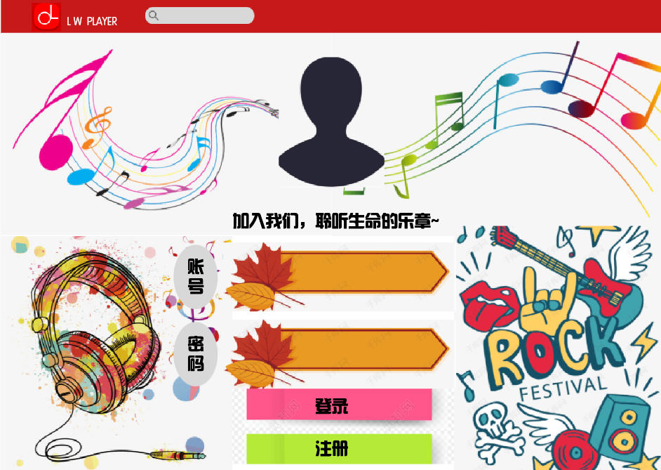
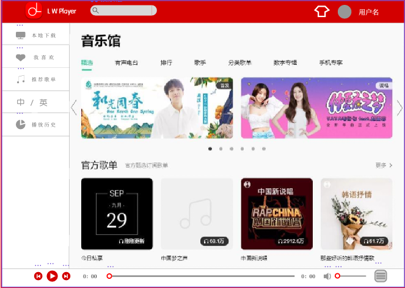
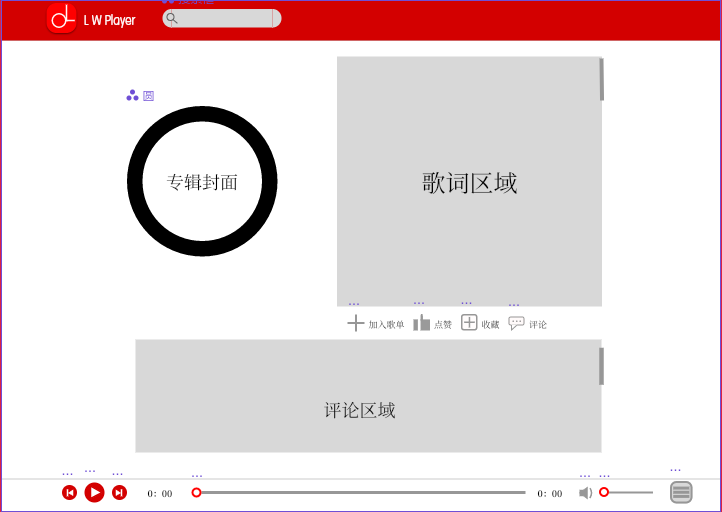
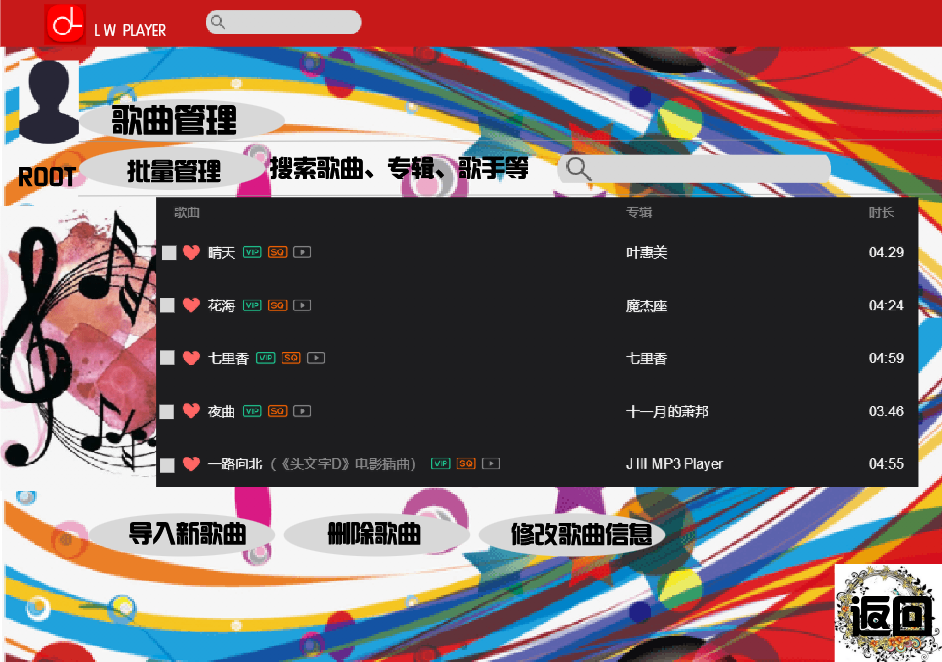
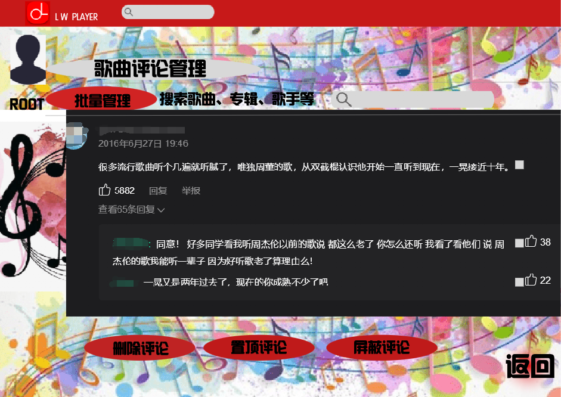

# 修订历史记录

| 日期      | 版本 | 说明                          | 作者           |
| --------- | ---- | ----------------------------- | :------------- |
| 2021.09.22 | V1.0 | 版本一, 根据项目设想生成. | 冯珞轩、文柯力 |
| 2021.09.25 | V2.0 | 版本二，添加ui设计与数据库设计 | 陈昊阳、陈柏钧 |
| 2021.09.28 | V2.1 | 版本二，添加类图、系统流程图、时序图| 郑宗汕、陈惟逸 |

# LWP音乐项目需求文档

------

## 1. 引言

### 1.1 项目背景

​		随着科学技术的发展，计算机科学技术日渐成熟，其强大的功能与便利性已被人们所熟知与接受。在人类社会的各个领域中，计算机科学技术发挥着越来越重要的作用。个人用户对于听音乐的需求也越来越大，用户对音乐检索与音乐播放需求越来越大。

​		故我们力求与开发一个LWP音乐网站，能够使得用户需要时检索并播放需求的音乐，随时分享自己的听歌感受，创建属于自己的歌单，网能够根据用户的听歌喜好分析并推荐音乐。为用户创造一个良好的听歌平台。

### 1.2 项目概述

#### 1.2.1 项目目标

系统开发目标：

1. 系统应具有实用性、可靠性和适用性。
2.  系统能够满足用户需求，使用户访问系统并注册账号后，能够实现验证帐号登陆系统的功能。
3. 需对各个数据库进行动态管理，防止混乱。
4. 能够按照用户的条件进行数据的简单查询以及复合查询。
5. 系统能够根据用户的条件，对数据进行相应的处理。
6.  能够对用户查询的结果进行分类汇总和美观的输出。
7. 注意数据的安全性，具备数据的备份以及恢复功能。
8. 方便用户的操作，用户界面需设计的合理美观，使用户操作流畅。

#### 1.2.2 项目有关人员

项目开发组成员：

- 组长：陈柏钧
- 组员：陈惟逸、郑宗汕、冯珞轩、陈昊阳、张钦博、文柯力

项目目标用户：
国内大学的学生以及老师

#### 1.2.3 项目实现环境

软件运行操作系统：Windows 7/8/10
数据库管理软件：mysql 8.0
开发语言： java

### 1.3 系统概述

本系统面向的用户为需要检索相关音乐、播放音乐、创建自己喜好的音乐歌单的人。

本系统旨在实现以下功能：

1. 用户能方便注册和登陆系统。
2. 用户能够搜索到歌曲/专辑的信息
3. 系统能够为用户推荐歌曲/专辑
4. 用户可以在正在播放的音乐下面留言评论、点赞、收藏
5. 用户能够创建歌单
6. 用户可以对播放页面进行自定义皮肤
7. 可以和他人共同听歌

### 1.4 名称定义和缩写

| 名称   | 缩写      | 定义                                |
| :----- | :-------- | :---------------------------------- |
| 开发者 | Developer | 对系统进行设计, 开发和维护.         |
| 用户   | User      | 管理员和用户.                       |
| 管理员 | Admin     | 系统对其具有透明性, 具有管理员权限. |

### 1.5 文档概述

​		编写本文档是为了保证项目团队按时按质地完成项目开发目标，便于项目团队成员更好地了解项目开发情况，使本软件开发工作的各个过程合理有序。以文件化的形式，将软件开发过程中各项工作的人员、分工、系统资源条件、软件开发进度计划、经费安排等问题记录下来，作为项目团队及项目关系人之间的约定与共识，团队开发和检查项目工作的依据，确保软件开发计划的开展以及软件开发的顺利进行。

## 2. 系统需求概述

------

### 2.1 LWP音乐用户端用例图

### 2.2 LWP系统端用例图

### 2.3 用例的概要描述

| 主要参与者 | 优先级 | 用例名 | 用例概述                                                     |
| -------- | ------ | ------ | -------------------------------------------------------------- |
| 用户       | 高     | 用户选择 | 用户进入系统后选择注册或登录选项                             |
| 用户       | 高     | 用户注册                                                     | 用户通过系统注册账号，若无误则录入，否则提示重新输入         |
| 用户       | 高     | 用户登录                                                     | 用户通过系统登录账号，若无误则登录成功，否则提示重新输入     |
| 用户       | 高     | 用户选择上传/播放本地音乐/搜索/播放歌单音乐/查看推荐/自定义皮肤/反馈bug | 执行相对应用况                                               |
| 用户       | 高     | 用户将在线歌曲添加到歌单                                     | 用户在“搜索歌曲”中搜索成功后，可将在线歌曲添加到歌单         |
| 用户       | 高     | 用户播放/点赞/收藏/评论在线歌曲                              | 用户在“搜索歌曲”中搜索成功后，可播放/点赞/收藏/评论该在线歌曲 |
| 用户       | 高     | 用户将推荐歌曲/歌单添加到歌单                                | 用户在“查看推荐歌单/歌曲”中推荐成功后，可将在线歌曲添加到歌单 |
| 用户       | 高     | 用户播放/点赞/收藏/评论推荐歌曲/歌单                         | 用户在“查看推荐歌单/歌曲”中推荐成功后，可播放/点赞/收藏/评论该在线歌曲 |
| 管理员     | 低     | 管理员登录                                                   | 管理员通过系统登录账号，若无误则登录成功，否则提示重新输入 |
| 管理员     | 高     | 管理员管理系统歌库                                           | 管理员可对歌曲库进行增删改查 |
| 管理员     | 低     | 管理员管理用户反馈信息                                       | 管理员可对用户反馈信息进行增删改查 |
| 管理员     | 低     | 管理员审核歌曲评论                                           | 管理员可对歌曲评论进行删除、屏蔽、置顶 |
| ……         | ……     | ……                                                           | …… |

### 2.4 假设和依赖

2. 管理员必须经过一定的培训.
2. 用户需有一定的使用类似产品的经历

## 3. 功能需求

------

### 3.1 LWP音乐用户端系统功能

**注册与登录**
- 用户进入系统时，系统提示用户选择注册或登录选项；
- 若用户选择注册选项，系统提示用户填入注册信息；用户输入注册信息：系统验证用户信息，若格式无误，录入信息，执行注册用例，否则提示用户重新输入。
- 若用户选择登录选项，系统提示用户输入登录信息；用户输入登录信息：系统验证用户登录信息，若无误则执行登录用例，否则提示用户重新输入。

**登录成功并使用**
- 若用户选择上传本地音乐，用户可以上传本地歌曲至音乐库内；
- 若用户选择播放本地音乐 ，用户可以播放本地音乐；
- 若用户选择播放歌单中的音乐，用户可以播放账号内歌单中的音乐；
- 若用户选择界面皮肤自定义，用户可以自定义皮肤；
- 若用户选择反馈bug，用户可以填写自己发现的bug并能后续被管理员处理。

**用户选择在线搜索歌曲**
- 若搜索成功，用户可对其进行加入歌单、播放。点赞、收藏、评论操作

**用户选择查看推荐歌曲**
- 若推荐成功，用户可对其进行加入歌单、播放。点赞、收藏、评论操作

### 3.2 LWP系统端系统功能

**管理员登录**

- 管理员输入正确的账号密码即可进入管理端对系统进行一定的管理与修改

**系统歌曲库管理**

- 管理员可对歌曲库进行增删改查

**用户反馈信息管理**

- 管理员可对用户反馈信息进行查询，并将其反馈给开发员

**歌曲评论审核**

- 管理员可对歌曲评论进行删除、屏蔽、置顶

## 4. 非功能需求

------

### 4.1 安全性

| **需求分类** | **定义要素**   | **需求内容**                                                 |
| ------------ | -------------- | ------------------------------------------------------------ |
| 系统安全     | 安全机制独立性 | 安全设计和实现应该具有独立性, 不能依赖当前主机的基础安全机制来确保自身和数据不受破环或拒绝服务. |
| 系统安全     | 安全机制有效性 | 应防止用户绕过其安全控制机制直接尝试访问系统各项功能.        |
| 系统安全     | 访问权限       | 对不同用户的访问权限进行严格的访问控制, 特定权限的用户只能看到和使用特定的界面及相应的功能. |
| 系统安全     | 输入限制       | 具备输入字符和输入数据的类型, 长度和范围检查功能.            |
| 系统安全     | 防止SQL注入    | 系统应没有SQL注入情况.                                       |
| 系统安全     | 权限初始化     | 用户的权限应该符合最小权限原则.                              |
| 系统安全     | 并发操作保护   | 允许用户对同一系统资源进行不相冲突的访问操作但应该禁止执行相互矛盾的操作, 如两个用户同时修改一个资源. |
| 系统安全     | 异常事件       | 应该定义了分级的系统异常事件, 并且根据异常的严重程度分别采用日志记录, 警告提示等方式进行通知. 对部分严重故障自动处理, 使学生信息系统恢复正常状态或保护现存数据安全. |
| 系统安全     | 安全日志系统   | 所有的系统出错信息都必须被记录到出错日志中, 信息的格式必须是系统错误号码, 日期, 时间, 错误信息. 和用户相关的每个页面迁移信息都必须被记录到追寻日志中. 信息的格式必须是用户帐号, 日期, 时间, 迁移的页面名. 每次处理前后的消耗的内存和处理时间都必须被记录到性能日志中. 信息的格式必须是日期、时间, 消耗的内存, 处理时间. |
| 系统安全     | 安全邮件系统   | 系统所有的电子邮件必须通过预先设定的邮件系统发送.            |
| 系统安全     | 安全监视系统   | 监视系统必须扫描日志系统如果有任何异常的情况, 必须使用邮件系统向管理员发警告信. |
| 系统安全     | 安全系统       | 安全系统必须拦截非法的访问, 和对网站的恶意进攻包括 (XSS , SQL Injection, 非法盗链等, 非法字符输入等). |
| 数据安全     | 数据完整性     | 能够检测到网络设备操作系统, 主机操作系统, 数据库管理系统以及信息系统的重要业务数据在传输过程中完整性受到破坏. |

### 4.2 易用性

| **需求分类** | **定义要素**                                                 | **需求内容**                                                 |
| ------------ | ------------------------------------------------------------ | ------------------------------------------------------------ |
| 用户界面     | 界面风格要求.                                                | 提供一致性的图形用户界面风格；                               |
| 界面导航要求 | 功能菜单必须按照功能模块, 功能项的分类方法进行组织; 对于用户无权使用的菜单功能应不显示该菜单或将其设置为不可用状态. | 每个模块相互分隔, 逻辑功能尽可能保持较小的冗余度.            |
| 界面输入要求 | 操作界面必须明确表示出必填的输入信息. 可以按照操作名称建立索引, 点击该事件后可以查看与该事件相关的应急相关信息. 可以按照关键字进行搜索, 系统在界面中将搜索结果分条展示. | 每个可能的输入都有确定的返回值, 如果出现异常会及时报错并提供正确的帮助信息. |
| 界面提示要求 | 发现用户提交有误信息, 必须以弹出窗口的形式明确提示用户错误的原因, 并把界面控制焦点置于发生错误的控件对象上; 在导致数据发生变化的操作执行之前, 应该弹出提示窗口供用户确认。 | LWP音乐系统的每个重要页面上必须都有相关的帮助页面的链接, 用户可以使用它们来获得必要的帮助信息. |

### 4.3 可靠性

- **可用性**
离线也可用本系统播放本地音乐

- **系统发生严重错误的平均时间间隔**
系统发生严重错误的平均时间间隔应该大于3000小时.

### 4.4 性能

- **最大的并发人数**

- 
  **最大系统响应时间**

- **最大的事务处理时间**

- **单次的事务处理时间**

## 5. 运行环境规定
-----

*我是规定*

## 6. 验收验证标准

-----

### 6.1 界面验收标准

*我是标准*

### 6.2 功能验收标准

*我是标准*

## 7. 团队分工

-----

- UI&UE 设计 陈柏钧 陈昊阳
- PM&User 冯珞轩 文柯力
- FE负责人 陈惟逸
- FE开发 陈惟逸 陈柏钧 陈昊阳
- Server负责人 郑宗汕
- Server开发 郑宗汕 文柯力 张钦博
- QA 张钦博 冯珞轩

# LWP音乐项目概要与详细设计文档

------

## 1. 总体设计

## 1.1 系统业务关系图

## 1.2 界面UI设计

由需求分析和系统业务关系产生，现阶段对系统的界面UI设计暂且设计为以下5个页面。

### 1.2.1 系统登陆界面

**页面描述**
页面分布含有2个文本输入框，实现用户对账户、密码的输入。页面分布的登录、注册按钮，实现对用户的账户注册、验证账户登录的功能。

### 1.2.2 用户端主界面

**页面描述**
用户登陆系统后的主界面，实现用户播放音乐的各种需求功能。

### 1.2.3 用户端歌曲播放界面

**页面描述**
用户播放歌曲时进入的页面，实现歌曲信息、评论信息的显示以及歌曲播放，暂停，快进等功能。

### 1.2.4 管理员端歌曲库管理界面

**页面描述**
管理员登陆后可选择进入的界面，可以对目前系统内爬取到的歌曲信息做统一管理。

### 1.2.5 管理员端评论审核界面

**页面描述**
管理员登陆后可选择进入的界面，可以对目前系统内所存在的所有评论信息做管理。

## 1.3 系统模块设计

由需求分析与系统业务关系图产生，对目前系统总结出6个功能模块：
1.ui模块：系统界面的各个按钮部分，负责对用户的点击进行各种信息反馈
2.搜索模块：对用户输入的歌曲名字在已有歌曲库内进行搜索。
3.user模块：对用户的登录、注册、最近听取、最近经常听取的歌曲信息进行接受。
4.播放模块：对歌曲进行处理并播放。
5.上传模块：接受用户上传的歌曲及歌曲信息。

## 2.功能模块设计

### 2.1 ui模块

#### 2.1.1 类图

#### 2.1.2 模块流程图

### 2.2 搜索模块

### 2.3 时序图

## 3.数据库设计

### 3.1 用户信息表

### 3.2 歌曲信息表

### 3.3 评论信息表

### 3.4 歌单信息表

